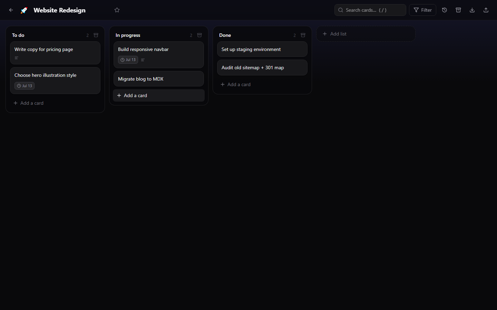

# 📋 Boardly

  

**The self-hosted Trello replacement. Pay once. Own it forever. No subscription.**

Trello charges **$5/user/month** — a 10-person team pays **$600 every year**, forever, for lists with cards on them. Boardly is the same kanban workflow running on *your* hardware: unlimited boards, unlimited "users" (it's your server), your data in a single SQLite file you can copy, back up, and export any time.



## ✨ Features

- **Multiple boards** — color themes, emoji icons, star your favorites
- **Drag & drop everything** — reorder lists, drag cards between lists; order persists exactly
- **Rich cards** — markdown descriptions, due dates with overdue highlighting
- **Checklists** — with live progress bars on the card front
- **Labels** — colored, board-scoped, filterable
- **Attachments** — upload files straight onto cards, stored locally
- **Comments + activity log** — full history per card and per board
- **Filter & search** — by label, by due date (overdue / this week / none), full-text card search
- **Keyboard shortcuts** — `n` new card, `/` search
- **Export / import** — full-fidelity JSON round trip (including attachment bytes) for backup or moving boards between installs
- **Archive, don't delete** — cards and lists archive first and can be restored anytime
- **100% local** — no telemetry, no external calls, no accounts

## 🚀 Quick start

```bash
npm i
npm run build
npm start        # → http://localhost:5315  (password: admin)
```

### 🖥️ Desktop app mode

Run it as a desktop app, or deploy to a $5 VPS when you need it public — same code, same data model:

```bash
npm run desktop  # Electron window, auto-logged-in, data in your OS user profile
```

Build a Windows installer with `npm run dist` (electron-builder, NSIS).

### 🐳 Docker / VPS

```bash
cp .env.example .env   # set ADMIN_PASSWORD!
docker compose up -d   # → port 5315, data persisted in a named volume
```

## ⚙️ Configuration

| Variable | Default | Purpose |
|---|---|---|
| `PORT` | `5315` | HTTP port |
| `ADMIN_PASSWORD` | `admin` | Sign-in password — change before going public |
| `DATA_DIR` | `./data` | SQLite db + attachment uploads |

## 🥊 Boardly vs Trello

| | **Boardly** | **Trello** |
|---|---|---|
| Price | **$19 once** | $5/user/**month** (Standard) |
| 10-person team, 3 years | **$19 total** | **$1,800** |
| Boards | Unlimited | Limited on free tier |
| Attachments | Your disk, your limits | 250 MB/file cap, plan-gated |
| Data ownership | SQLite file on your box | Atlassian's cloud |
| Works offline / air-gapped | ✅ | ❌ |
| Telemetry | None | Plenty |
| Export | Full-fidelity JSON, one click | JSON export is plan-gated |

## ☕ Skip the setup — get the 1-click installer

Don't want to touch a terminal? The packaged installer (plus updates and setup support) is a one-time **$19** on Whop:

**→ [https://whop.com/benjisaiempire/boardly](https://whop.com/benjisaiempire/boardly)**

The source here is MIT and always will be — the paid version is purely convenience.

## 🧱 Tech stack

- **Backend:** Node 20+, Express, better-sqlite3 (WAL mode), multer
- **Frontend:** React 18, Vite, Tailwind CSS 4, Framer Motion, @hello-pangea/dnd, Lucide icons, marked
- **Desktop:** Electron wrapper around the same Express server (electron-builder for NSIS installers)
- **Tests:** `npm test` boots the real server and runs 13 end-to-end API smoke checks

## 🧪 Verify

```bash
npm test
```

Covers: board/list/card CRUD, drag-move persistence, checklist progress, label filters, due-date filters, search, comments + activity, attachment byte-fidelity, archive/restore, and a full export→import deep-equal round trip.

## License

MIT © 2026 Ben (bensblueprints)
