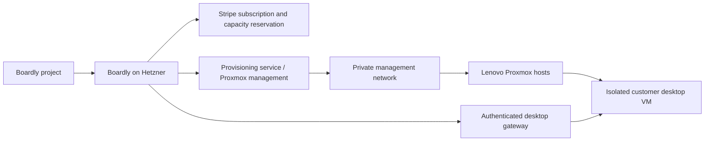

# Project Computer Use add-on

Ben's package: **$29.99 USD per month per computer**, **8 GB RAM**, **150 GB storage**. One Lenovo ThinkCentre mini is on order; seven more are planned. The working interpretation is one isolated virtual desktop per subscription. Lenovo model, CPU, host RAM/SSD, purchase cost and physical location are awaiting confirmation. AI usage continues under the existing account AI funding rules; the hardware price does not include an unlimited AI allowance.

## Current implementation

Every cloud project has a **Computer use** panel displaying the package and planned monthly total. Account owners can save/update/cancel an availability request; shared project members can view it. Requests persist in `project_computer_requests` inside the correct account workspace and are removed when that project is deleted. They do not create subscriptions, VMs or agent runs. Checkout returns 503 and computer access is unavailable until the provisioning and billing lifecycle below is implemented and verified. Public wording explicitly says Coming soon / no payment taken.

Run `node scripts/preview-computer-price.cjs` for the offline Stripe product/price payload. It specifies a monthly licensed unit price of 2999 cents; it performs no API calls. Boardly's existing billing implementation is Stripe with Clerk identity, so this add-on should extend that billing system. Production currently has no Stripe secret, webhook or portal configured. An availability request, client-supplied paid flag, or successful checkout redirect must never grant computer access.

## Verified Hetzner inventory — 2026-09-09

Read-only inspection of the existing `hetzner` SSH host shows:

- Bare metal, Proxmox VE manager 8.4.20; `/dev/kvm` exists.
- 12 logical CPUs and 67,274,940,416 bytes of physical RAM (about 62.7 GiB).
- One VM and fourteen containers; configured guest memory ceilings total about 107 GiB and configured guest CPU counts total 42. These are configured limits, not simultaneous consumption or a claim of guaranteed reservations. They already exceed physical resources, so currently free RAM is not a safe paid-computer inventory.
- `local` has about 73.9 GiB free; `local-lvm` has about 364.1 GiB free at inspection. Thin-pool free space alone does not account for all potential growth, backups or operational reserve.
- The current Boardly application is already running on this host. No existing guest, kernel, network, storage or cluster configuration was changed.

`scripts/computer-host-preflight.py` collects the same nonsecret inventory when run on a candidate Proxmox host. It performs only reads and always reports sales readiness false: inventory alone does not establish a tested customer desktop service.

## Recommended topology, subject to physical placement

If the Lenovos are at Ben's location, install Proxmox VE on the Lenovo hosts and manage them remotely from Hetzner through a private network. Proxmox Datacenter Manager can manage independent nodes or clusters across locations, including guest power operations. Use verified TLS certificates or explicitly verified certificate fingerprints. [Proxmox remotes documentation](https://pdm.proxmox.com/docs/remotes.html).

Keep any Proxmox quorum cluster on a suitable local network. Do not stretch a Corosync cluster between a distant Lenovo site and Hetzner as the default design: cluster communication needs consistent low latency and cluster joins overwrite the joining node's existing cluster configuration. Remote management does not require one stretched cluster. [Proxmox cluster documentation](https://raw.githubusercontent.com/proxmox/pve-docs/master/pvecm.adoc).

If the customer desktops are to run at Hetzner, use explicitly allocated bare-metal capacity or an appropriate dedicated host. Ordinary Hetzner Cloud VMs do not support nested virtualization; this restriction is distinct from Ben's current bare-metal Proxmox server. [Hetzner Cloud FAQ](https://docs.hetzner.com/cloud/servers/faq/).

A customer receives a session for their assigned VM, never a Proxmox administrator login. The infrastructure management network must be unreachable from customer desktops. AI computer actions require the existing explicit Work authorization, a currently entitled project computer, an exclusive controller lease and a Stop/revoke action. Human desktop access and AI control must have explicit ownership so both do not type or click concurrently.

## Host sizing and economics

An 8 GB physical mini cannot dedicate all 8 GB to a customer VM while also reserving RAM for Proxmox. The host needs additional RAM and storage beyond the customer package. Determine CPU, RAM, disk and I/O headroom from the actual model and a measured pilot workload before selling slots.

For a preliminary RAM-only illustration, a 16 GiB host with 4 GiB reserved could fit one 8 GiB guest; 32 GiB with 4 GiB reserved could fit three; 64 GiB with 8 GiB reserved could fit seven. These are ceilings from arithmetic, not sellable capacity or a recommendation to overcommit CPU/disk. Disk, CPU, backup reserve and performance can lower the result. Eight physical minis do not automatically mean eight or any other fixed number of subscriptions.

Eight paid computers would generate **$239.92/month gross**, requiring 64 GB of customer RAM and 1,200 GB of customer disk before host/backup overhead. Hardware purchase costs have not been supplied, so profit and payback are not established. Calculate contribution after electricity, internet, backup capacity, hosting, payment fees, support, replacements and any software licenses; then compare hardware cost against that contribution. Use a Linux browser desktop for the pilot unless a Windows requirement is confirmed; Windows licensing must be resolved before offering Windows desktops.

## Concrete rollout

1. Confirm Lenovo model/CPU/RAM/SSD/cost, delivery, physical location and the VM-per-subscription interpretation. Confirm whether $29.99 is the intended USD price and whether the existing separate AI funding arrangement is retained.
2. Inspect the arriving machine, firmware virtualization settings, storage health and network. Prepare Proxmox installation against its explicitly selected target disk. Do not reimage the existing Hetzner host or join its cluster as a shortcut.
3. Establish private management connectivity. Prepare an isolated guest network with default-denied access to host management, other customers, private infrastructure and metadata services. Confirm internet egress and DNS while preventing private-network bypasses, including IPv6. Keep Proxmox/remote-desktop administrator endpoints off public customer routes.
4. Build a clean desktop template with a supported Linux desktop/browser, guest agent, fresh per-VM credentials, 8192 MiB fixed RAM and a 150 GiB virtual disk. Set CPU shares from the pilot benchmark; no vCPU entitlement has been promised yet. Resolve actual network bridge, storage pool and template ID before preparing mutation commands.
5. Verify browser/desktop control, screenshot and input flow, exclusive controller ownership, cancellation, account/project isolation, session expiration, VM reboot/reconnect and a real backup restore. Prove that the VM cannot reach Proxmox management or another customer's desktop.
6. Add a durable central allocator: host capacity budgets minus existing guests and reserve; transactional allocation; stable VM IDs; lifecycle states reserved/provisioning/ready/running/stopped/suspended/releasing/error. Keep uncertain provider outcomes for reconciliation, not blind clone retries. Bind each VM to an account and project; owner reassignment within an account must revoke sessions and preserve billing.
7. Extend Stripe with the previewed computer product. Reserve verified capacity before hosted checkout; correlate the checkout, customer, subscription item and VM. Prefer per-computer subscription items or another explicit mapping that allows cancellation of a named computer. Stripe supports quantities and multiple subscriptions, but the application still owns allocation and lifecycle reconciliation. [Stripe quantity/subscription documentation](https://docs.stripe.com/billing/subscriptions/quantities).
8. Verify signed events and retrieve authoritative paid state for access. Reconcile duplicate/out-of-order events, payment failures, abandoned checkout, capacity expiry, renewal, cancellation at period end and provisioning failure/refund handling. Define retention/export and erasure policy before customer signup; do not silently delete customer disks on a failed renewal.
9. Enable paid sales only after the actual desktop, isolation, recovery, billing and capacity tests pass. Add new Lenovo nodes through the same measured readiness process, starting with one pilot and adding the next seven incrementally.

## Outstanding activation dependencies

Physical Lenovo details/location and arrival/access; a reviewed capacity budget and isolated VM template; working desktop/AI session gateway and allocator; production Stripe setup and computer checkout/reconciliation; tested recovery and retention rules. The shipped panel is the prelaunch request stage, not a working paid computer service.
