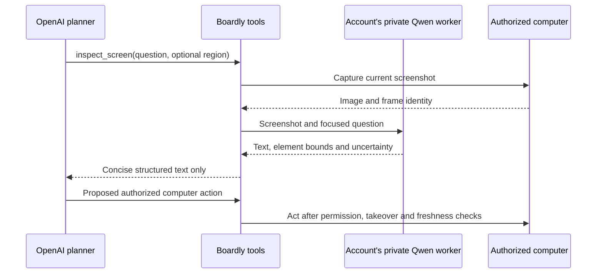

# Private account GPU vision — comparison and proposed design

Prepared 2026-09-12 for Boardly card 204. Status: proposal; no model installation or production routing change has been made.

Ben's RTX 5060 Ti should serve his account only. Other customers should be able to connect their own GPU computers to their own accounts. Connected computers are private resources, not a shared Boardly compute pool.

## Recommendation and verified starting point

Keep OpenAI as the planner and use a local Qwen vision model to answer specific questions about screenshots. Boardly executes the local vision tool and returns text findings to OpenAI. This follows the normal application-executed [OpenAI function calling flow](https://developers.openai.com/api/docs/guides/function-calling).

Read-only checks of Ben's computer found an RTX 5060 Ti with 16,311 MiB of VRAM. ComfyUI held 14,704 MiB; its queue had no running or pending jobs at the time of inspection. No working Qwen endpoint was verified. Neither Ollama nor llama-server was detected in the checked PATH. This is hardware/access verification, not an inference benchmark.

Start evaluation with Qwen3-VL-8B-Instruct, Q4_K_M, with its vision projector. The official files are 5.03 GB for language weights and 1.16 GB for the F16 projector. Those are download sizes; runtime buffers, visual tokens and context consume additional memory. This is a plausible 16 GB candidate with bounded context, not a verified fit under every workload. The full F16 language weights alone are 16.4 GB. [Official Qwen files](https://huggingface.co/Qwen/Qwen3-VL-8B-Instruct-GGUF/tree/main).

ComfyUI and Qwen need coordinated GPU scheduling. Start with one inference at a time, unload idle models when switching workloads, and never unload an active image-generation job. Cold loading adds latency; dedicated vision residency would give more predictable response times.

## Comparison

| Factor | OpenAI reads screenshots | Qwen on the account's GPU, OpenAI plans |
| --- | --- | --- |
| Usage cost | Image input, other context and model output consume usage | No local per-image API charge; electricity and hardware operation remain. OpenAI still consumes text/reasoning usage |
| Visual information | Planner receives the image directly | Planner receives selected findings; omissions and OCR errors can affect decisions |
| Quality | Existing baseline; still requires verification | Must test small text, tables and button locations on the real tasks before replacing the baseline |
| Latency | Cloud upload and inference | Adds local inference and a tool round trip; queueing and model loading may dominate. No speed advantage has been measured |
| Availability | Provider and network dependent | Account computer must be online and GPU capacity available |
| Data flow | Screenshot goes to OpenAI | Vision inference uses the account's private GPU; extracted text still goes to OpenAI. Boardly's authenticated screenshot transport may also handle the image |

API illustration, not Ben's measured bill: a 1280 × 800 screenshot at GPT-6 Astra high detail has 40 × 25 patches, multiplied by 1.2, or approximately 1,200 image tokens. At standard uncached input pricing of $10 per million tokens, that is $0.012 per image. Ten thousand such observations cost about $120 for image input. Replacing each with a hypothetical 200-token local summary costs about $20 in OpenAI summary input, plus local operating costs. This is approximately 83% less for that input component only. Prompt history, tool schemas, retries, output/reasoning, caching and service tier change total cost. A ChatGPT/Codex subscription allowance is not a per-token API invoice. [Image token rules](https://developers.openai.com/api/docs/guides/images-vision), [Astra pricing](https://developers.openai.com/api/docs/models/gpt-6-astra).

## Proposed account setup

1. Open **Settings → AI → GPU computers → Add a computer**.
2. Install the connector on the computer that contains the GPU and enter a short-lived pairing code. Show clear steps and a copy button. The connector authenticates an outbound/private connection; customers should not need a public inference port.
3. Detect hardware and supported runtimes. Explain model download size and memory needs before installation; verify compatibility rather than promising every graphics card works.
4. Run a test image and show **Ready**, **Busy**, **Offline**, or an actionable error.
5. Choose permitted companies/projects, whether this is the account's default vision worker, and concurrency limits. Offer **Use my GPU only** and **Allow OpenAI fallback with a spending limit**; default this private setup to GPU only.
6. Show queue, recent usage and connection status. Allow disconnect/revocation without exposing keys to the browser.

Pairing and dispatch must derive ownership from authenticated account/workspace state. Enforce company membership and desktop permissions on every request; knowing another account's worker ID must never grant access. Keep credentials, queues, stored screenshots and usage records isolated. Ben's GPU must never become another customer's fallback. A company shared across accounts does not implicitly share GPU capacity.

## Proposed execution flow

Prefer browser text/accessibility data and document extraction before vision where available. Bound local answers to the question; avoid repeatedly sending entire page OCR. Preserve frame identity, dimensions and crop transforms so element locations refer to the correct screenshot. Treat screenshot text and model output as untrusted observations, not instructions granting privileges. Validate the next action against a fresh screen when necessary.

Do not include the original image alongside the summary: that preserves the cloud vision usage we intend to remove. Cover both hosted API tools and Codex/MCP screenshot paths, including direct image attachments. Keep human takeover, pause and agent resumption behavior intact. An offline GPU or uncertain result should request a fresh crop, queue, or clearly pause the affected operation. Cloud fallback must follow explicit account settings and its budget, without retry storms or silent spending.

## Implementation touchpoints and acceptance evidence

At source revision `1f1b926`, `server/hosted-ai.js` sends screenshot tool output to OpenAI as `input_image` with `detail: high`. `scripts/codex-worker.cjs` instructs Codex to view screenshot files directly. Both paths need the local inspection tool when private vision is selected. The live computer window's JPEG preview is a human display stream and does not itself perform model inference on every frame.

Before enabling the feature, verify:

- Screenshot-to-text behavior end to end in hosted API and Codex paths; no image reaches OpenAI in GPU-only mode.
- OCR, target location accuracy, retries and completed task success against the existing cloud baseline on representative screens.
- Cold/warm latency, peak GPU memory and concurrent requests, including ComfyUI scheduling and worker restart.
- Account isolation, shared-company membership changes, device revocation, stale frames and human takeover.
- Offline/busy behavior and explicit fallback limits; compare measured total usage per completed task rather than savings per screenshot alone.

These checks remain implementation requirements. No performance, accuracy or whole-bill savings claim has been validated by running Qwen on Ben's GPU.
